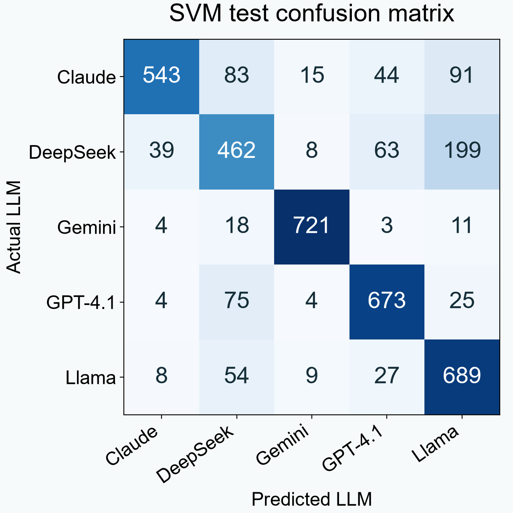
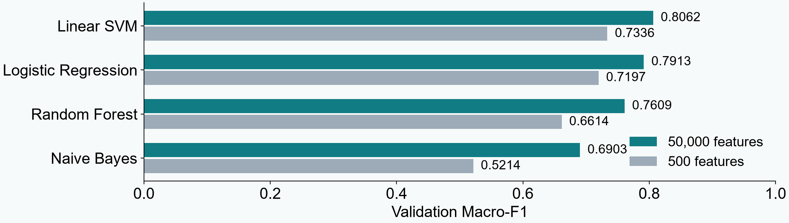

# LLM authorship assignment

**Five LLM author classes · Four classifiers · 20,000 C programs**

[Results](#experiment-1-results) · [Confusion matrix](#confusion-matrix-where-svm-makes-mistakes) · [SVM mathematics](#how-linear-svm-works) · [Download the five slides](submission/Assignment.pptx) · [Run the code](#run)

We use 20,000 C programs to test whether code patterns identify the LLM that wrote them. This connects to our research topic of LLM-generated code attribution.

## Why this dataset?

LLM-AuthorBench provides generated C code with known author labels, directly matching our code-attribution question. Our five-class subset has 4,000 programs per author, keeps the language fixed and is practical for CPU experiments. Comments and character patterns also give us clear ablation tests. These results apply to this benchmark setting; they do not prove authorship of arbitrary real-world code. Dataset licensing still needs confirmation.

## Experiments

**Experiment 1: original code.** Train Naive Bayes, Logistic Regression, Linear SVM and Random Forest on the same character TF-IDF features. Choose the highest validation Macro-F1, then report test scores.

**Experiment 2: remove comments.** Repeat with the same split, seed and model settings. Compare scores and rankings. The prediction and its exploratory status are in [PLAN.md](PLAN.md).

**Experiment 2B: 500 features.** Keep the original code and comments, but restrict the training-fitted TF-IDF vocabulary from 50,000 to 500 patterns. Keep all model settings and sample assignments fixed.

## Experiment 1 results

Held-out test scores on **3,872 programs**. We chose the winner using validation Macro-F1.

| Model | Accuracy | Macro-F1 | Fit seconds | Size MB |
|---|---:|---:|---:|---:|
| Naive Bayes | 62.68% | 0.6278 | 0.12 | 2.898 |
| Logistic Regression | 76.89% | 0.7704 | 15.17 | 0.863 |
| Linear SVM | 79.75% | 0.7970 | 5.36 | 1.767 |
| Random Forest | 69.01% | 0.6796 | 20.11 | 9.935 |

Linear SVM won on validation with Macro-F1 **0.8062**. Removing comments lowered every model's score but left the ranking unchanged. SVM test Macro-F1 fell from **0.7970 to 0.6032**. Its validation lead over Logistic Regression grew from **1.49 to 3.03 percentage points**, contrary to our prediction. Comments help attribution, but do not establish why SVM uniquely wins.

The feature-limit follow-up narrowed SVM's validation lead over Logistic Regression from **1.49 to 1.39 percentage points**, only **0.10 points**. All four rankings stayed unchanged. This weakly supports the predicted gap direction, but still does not explain the winner conclusively. See [feature results](results/feature_comparison.csv) and [interpretation](results/feature_interpretation.md).

Fit time excludes TF-IDF. Model size is the compressed classifier, excluding the shared vectorizer. These are single-run measurements without confidence intervals.

## Confusion matrix: where SVM makes mistakes



Rows are the actual LLM; columns are the prediction. Diagonal entries are correct: **3,088 of 3,872**, giving **79.75% accuracy**. The largest off-diagonal count is 199 DeepSeek programs predicted as Llama. Labels are shortened for readability.

## Experiment 2B: what changes with 500 features?



## How we measure performance

For each class, precision asks how many predictions of that class were correct; recall asks how many actual examples of that class were found.

$$P_k=\frac{TP_k}{TP_k+FP_k},\qquad R_k=\frac{TP_k}{TP_k+FN_k}$$

$$F1_k=\frac{2P_kR_k}{P_k+R_k},\qquad \mathrm{Macro\text{-}F1}=\frac{1}{5}\sum_{k=1}^{5}F1_k$$

Here TP means correct predictions of class k, FP means other classes incorrectly predicted as k, and FN means class k incorrectly predicted as another class. Undefined scores are set to zero. Macro-F1 gives each of the five classes equal weight. It is the average of class F1 scores, not F1 calculated from average precision and recall.

Recreate the PNG files after running the experiment:

```text
python make_figures.py
```

## How Linear SVM works

**SVM means Support Vector Machine.** Our `LinearSVC` learns five one-vs-rest classifiers: each author against the other four. It uses the same input features as the other models.

### 1. Turn code into numbers

**TF-IDF means Term Frequency–Inverse Document Frequency.** TF describes pattern repetition inside one program. IDF reduces the relative weight of patterns appearing in many training programs. Each term here is a 3–5-character pattern, and each document is one program.

For a pattern that appears at least once:

$$\mathrm{TF}=1+\ln(\mathrm{count}),\qquad \mathrm{IDF}=1+\ln\left(\frac{1+N}{1+\mathrm{df}}\right)$$

Multiply TF by IDF, then divide the nonzero vector by its Euclidean length. Absent patterns get zero weight. `N` is the number of training programs; `df` counts training programs containing that pattern; `ln` is the natural logarithm. This produces the feature vector **x**. The vocabulary and IDF are learned from training only.

### 2. Give each author a score

$$f_k(x)=w_k^T x+b_k,\qquad \widehat{y}=\operatorname*{arg\,max}_{k} f_k(x)$$

| Symbol | Plain meaning |
|---|---|
| x | The program's TF-IDF feature weights |
| k | One of the five author classes |
| w_k | Feature weights learned for author k |
| w_k^T x | Multiply matching weights and features, then sum them (dot product) |
| b_k | Learned offset, also called the intercept |
| arg max | Choose the author with the largest score |

These scores are not calibrated probabilities.

### 3. Learn weights by minimizing a cost

For one author versus the rest, our default **L2-regularized, squared-hinge LinearSVC** minimizes:

$$\min_{w,b}\;\frac{1}{2}\left(\lVert w\rVert_2^2+b^2\right)+C\sum_{i=1}^{n}\left[\max\left(0,1-y_i(w^T x_i+b)\right)\right]^2$$

- `i` indexes training programs; `n = 13,150` in this experiment.
- `y_i = +1` for the chosen author and `−1` for other authors.
- The first term discourages large weights. The sum penalizes examples whose signed score falls below the target margin of 1.
- `C = 1` balances these terms. Smaller C generally means stronger regularization.
- The `b²` term reflects our default `intercept_scaling=1`: this implementation regularizes the intercept too.

**Toy loss calculation:** if `y_i f(x_i) = 0.6`, squared-hinge loss is `(1 − 0.6)² = 0.16`. If the signed score is at least 1, the loss is zero. At −0.5 it is 2.25. These are teaching examples, not measured predictions.

**How to explain it aloud:** “SVM learns how strongly each code pattern supports an author. It balances smaller weights against penalties for examples that fall inside the margin or on the wrong side. We calculate five scores and choose the largest.”

This describes how SVM works. Its winning score and the ablations are separate evidence; the equation alone does not establish why it won. Implementation reference: [scikit-learn LinearSVC](https://scikit-learn.org/stable/modules/generated/sklearn.svm.LinearSVC.html).

## Run

Use Python 3.12 locally:

```text
python -m pip install -r requirements.txt
python assignment.py
```

The dataset downloads automatically if missing. Start with [assignment.py](assignment.py). Run `python make_figures.py` to rebuild the figures from saved results.

## Where things are

- [assignment.py](assignment.py): all experiment code, clearly labeled.
- [results/](results/): separate `experiment_1_original` and `experiment_2_no_comments` folders, plus `experiment_2b_500_features` and combined tables.
- [Five slides](submission/Assignment.pptx).

<details>
<summary>Dataset, preprocessing and reproducibility details</summary>


[LLM-AuthorBench](https://github.com/LLMauthorbench/LLMauthorbench) contains 32,000 programs from eight LLMs. We select the paper's five labels: `gpt-4.1`, `deepseek-chat`, `claude-3.5-haiku`, `gemini-2.5-flash-preview-05-20` and `llama-3.3-70b-instruct`. Each contributes 4,000 programs. The authors describe generation from 300 parameterized C-programming templates followed by deduplication and compilation filtering. We read the programs as text and do not execute them.

Version: upstream commit `6a1c2ac173c774cfbd012f4c81e8d0a51bb61eb7`. Archive SHA-256: `e24399b7b05b812c5a1148ef44245348859eaa74b1140523cb695f984337f24c`. Inspected September 29, 2026. The original user-supplied download date is unknown.

**Licence: unverified.** Public download availability does not establish research-use permission. No explicit dataset licence was found during the earlier repository review. Confirm permission before submission.

The five-class data has zero missing required values, empty programs or exact source duplicates. We reuse the existing task-family split, filtered to the five labels: 13,150 training, 2,978 validation and 3,872 test programs. All five classes occur in every split. Counts are in `results/class_counts.csv`.

`data/splits.csv` is a committed preprocessing artifact, so rerunning does not require the earlier grouping code. That preparation normalized prompt parameters, joined audited task aliases and similar descriptions, then assigned 259 inferred families using seed 42. Its source remains available at [the earlier preparation commit](https://github.com/S3eeDTR/LLM-AuthorBench-Assignment/blob/33b42098d3bfdeddd8d94c77326a22fb8847be0a/src/prepare_data.py). We check separation of families, exact prompts and source hashes. The dataset has no official task IDs: inferred groups may overmerge tasks, and unrecognized semantic overlap remains a limitation.


Experiments 1 and 2 use training-only character TF-IDF: 3–5 grams, up to 50,000 features, sublinear frequency, case preserved and float32 values. The analyzer normalizes repeated whitespace. Model parameters are together in `run_experiment`. Stochastic models use seed 42. There is no tuning search. Uniform-chance accuracy is 20%.

The five labels match the [paper](https://arxiv.org/abs/2506.17323), but our group split, validation partition, features and algorithm choices differ. This is not a reproduction of the paper's scores. Earlier eight-class results were known before this rebuild; the ablation remains exploratory.

Versions are pinned in `requirements.txt` and recorded in `results/environment.json`. The recorded run used Python 3.12.14. Trained models, raw data and temporary files stay local and are ignored by Git. The old implementation is recoverable from Git history.

</details>

## Before submission

Confirm the dataset's research-use permission and instructor claim. **Licence remains unverified.** Member names and actual contributions will be added by the group; each member must contribute under their own Git identity. The ablation's failed prediction is reported honestly and does not fully establish the requested explanation of the winner.

## AI use and sources

AI assisted with writing, simplifying, checking and explaining the code and documentation. Group members must review and understand it. Sources: [LLM-AuthorBench](https://github.com/LLMauthorbench/LLMauthorbench), [paper](https://arxiv.org/abs/2506.17323), and [scikit-learn](https://scikit-learn.org/stable/). Supporting libraries are NumPy, pandas and joblib.
