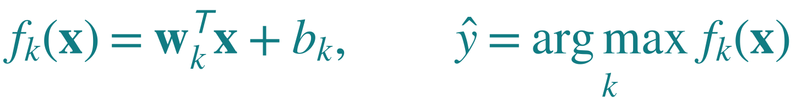
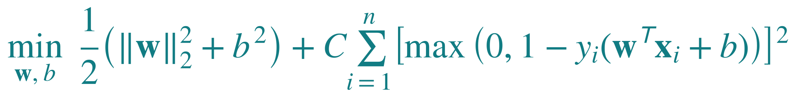
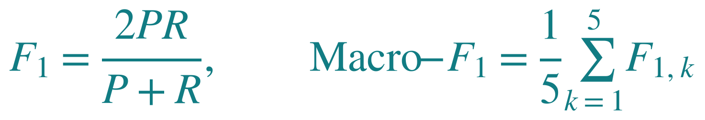

# LLM authorship classification

Predict which LLM generated a C program. Our main experiment compares four classical classifiers. A separate exploratory CodeT5 run checks whether a pretrained encoder can learn the same five author labels.

[Download the presentation](submission/Assignment.pptx) · [Experiment code](assignment.py) · [Saved classical results](results/metrics.csv)

## Dataset

Data comes from **[LLM-AuthorBench](https://github.com/LLMauthorbench/LLMauthorbench)**, associated with the paper [I Know Which LLM Wrote Your Code Last Summer](https://arxiv.org/abs/2506.17323). Our instructor approved the dataset by email. This course project investigates whether patterns in generated code can identify its source model.

We use **20,000 C programs**, with 4,000 from each author: Claude 3.5 Haiku, DeepSeek Chat, Gemini 2.5 Flash Preview, GPT-4.1 and Llama 3.3 70B Instruct. Known author labels, balanced classes and a common programming language make this dataset suitable for comparing code-attribution methods.

| Partition | Programs | Inferred task groups |
|---|---:|---:|
| Training | 13,150 | 181 |
| Validation | 2,978 | 38 |
| Test | 3,872 | 40 |

The saved split keeps related task groups together. Checks found no empty programs or exact source duplicates in the selected subset, and no shared groups, exact prompts or source hashes across partitions. Groups are inferred, so unrecognized semantic overlap may remain. Matching the paper's five labels does not reproduce its experimental setup.

## Experiments

1. **Original code:** compare Naive Bayes, Logistic Regression, Linear SVM and Random Forest using character TF-IDF with up to 50,000 patterns of 3–5 characters. Fit the vocabulary on training data only.
2. **Remove comments:** repeat the four-model comparison with the same split and settings.
3. **Restrict features (2B):** retain comments but reduce the vocabulary to 500 patterns.
4. **Exploratory CodeT5:** a separate original-code run with `Salesforce/codet5-base`, masked mean pooling and a five-class head. Five epochs completed on an A100; validation selected epoch 3. It was not included in the comment-removal or feature-reduction ablations. [Notebook and saved results](codet5/).

We chose Naive Bayes as a simple probabilistic baseline, Logistic Regression and Linear SVM to compare two linear learning objectives, and Random Forest as a nonlinear tree ensemble. All four use the same TF-IDF features within each condition. CodeT5 is documented separately as an exploratory transfer-learning run.

Here, **50,000 or 500 features** means the maximum number of distinct character patterns retained by training-corpus frequency. It does not change the number of programs.

## Main results: four classical models

Held-out test results on the same **3,872 programs**:

| Model | Accuracy | Macro-F1 | Time (s) | Saved size (MB) |
|---|---:|---:|---:|---:|
| Naive Bayes | 62.68% | 0.6278 | 0.12 | 2.898 |
| Logistic Regression | 76.89% | 0.7704 | 15.17 | 0.863 |
| **Linear SVM** | **79.75%** | **0.7970** | **5.36** | **1.767** |
| Random Forest | 69.01% | 0.6796 | 20.11 | 9.935 |

**Linear SVM performed best among the four classical models.** Its original validation Macro-F1 was 0.8062. These models share TF-IDF features within each condition and use the same split.

Times measure CPU classifier fitting only, excluding TF-IDF. Sizes are compressed classifier files; the vectorizer is saved separately.

### SVM confusion matrix


Rows are actual authors; columns are predicted authors. The diagonal contains **3,088 correct predictions**. The largest error cell is 199 DeepSeek programs predicted as Llama.

### What the classical ablations showed

These ablations were completed for Naive Bayes, Logistic Regression, Linear SVM and Random Forest only. **CodeT5 was not tested after comment removal.**


Removing comments reduced every model's score, but SVM's validation lead over Logistic Regression grew from **1.49 to 3.03 percentage points**, contrary to the prediction. Limiting features to 500 narrowed that lead to **1.39 points**, a change of only **0.10 points**. Neither test changed the rankings.

A plausible explanation is that SVM's regularized margin objective suits the sparse character TF-IDF representation. Comments and a richer vocabulary helped performance. These exploratory, single-split results do not conclusively explain why SVM won or establish statistical significance.

## Exploratory CodeT5 run

We also tried a pretrained CodeT5 encoder on original code to see how it learned the author labels. This is separate from the main four-model comparison and is not a reproduction of the paper's architecture or a full ablation study.

- Test accuracy: **76.96%**; test Macro-F1: **0.7725** on the same 3,872 test programs.
- Five epochs completed; epoch 3 selected by validation Macro-F1 (**0.7998**).
- Input: up to 256 tokens; batch size 16; learning rate 0.00002.
- **No CodeT5 comment-removal ablation was run.** The 500-feature condition applies to TF-IDF models, not this neural model.

[Open the notebook in Colab](https://colab.research.google.com/github/S3eeDTR/LLM-AuthorBench-Assignment/blob/main/codet5/CodeT5_Exploratory.ipynb) · [CodeT5 folder and recorded results](codet5/)

The presentation shows its score alongside the classical results for context; that does not make it a matched model or ablation comparison. Its recorded 291.71 seconds includes GPU training, validation and saving, and its 438.494 MB checkpoint contains uncompressed weights. These differ from the classical timing and storage conventions.

<details>
<summary>Mathematics: TF-IDF, SVM and Macro-F1</summary>

**TF-IDF** means Term Frequency–Inverse Document Frequency. It weights character patterns by their repetition in one program and their frequency across training programs. We use logarithmic term frequency, smoothed IDF and L2 normalization.

**SVM scoring:** multiply each feature by its learned weight, sum the products, add the intercept and select the author with the largest score.



Here x is the feature vector, w contains learned weights, b is the intercept, and k identifies an author. We train five one-vs-rest classifiers.



The first term penalizes large weights and intercepts. The sum is squared-hinge loss across training examples. The binary label y is +1 for this author and −1 for the others. C = 1 balances loss against regularization. Our LinearSVC uses intercept scaling 1, so the intercept is regularized too.



P is precision (correct predictions of a class divided by all predictions of that class). R is recall (correct predictions of a class divided by its actual examples). Macro-F1 averages the five class F1 scores equally. Undefined scores are set to zero. Models and checkpoints are selected using validation scores, not test scores.

Reference: [scikit-learn LinearSVC](https://scikit-learn.org/stable/modules/generated/sklearn.svm.LinearSVC.html).

</details>

## Run the classical experiments

Use Python 3.12 in the project folder:

```text
python -m pip install -r requirements.txt
python assignment.py
python make_figures.py
```

The dataset downloads automatically if missing. `assignment.py` contains data checks, shared training steps and labelled experiments. `make_figures.py` creates charts and equation images from saved results. These commands do not run CodeT5. Rerunning replaces generated classical outputs.

<details>
<summary>Reproducibility and source details</summary>

Dataset snapshot: upstream commit `6a1c2ac173c774cfbd012f4c81e8d0a51bb61eb7`, inspected September 29, 2026. Archive SHA-256: `e24399b7b05b812c5a1148ef44245348859eaa74b1140523cb695f984337f24c`.

`data/splits.csv` stores the seed-42 task-family assignments, not the source code itself. The source code is in the downloaded archive's `c_code` field. The script joins programs to their assignments using row ID, author label and source hash; IDs and hashes are not model features.

The allocation is approximately 70/15/15 by group count; the actual program proportions are 65.75% training, 14.89% validation and 19.36% test.

`data/splits.csv` preserves the original assignments. The earlier preparation normalized prompt parameters and merged audited aliases and similar descriptions. Its [source](https://github.com/S3eeDTR/LLM-AuthorBench-Assignment/blob/33b42098d3bfdeddd8d94c77326a22fb8847be0a/src/prepare_data.py) remains available. The current script reuses and verifies the split.

Model settings appear in `assignment.py`; package versions appear in `requirements.txt` and `results/environment.json`. Classical results are saved separately for each condition. Earlier outcomes were known before the ablations, so their interpretation is exploratory.

Instructor approval confirms the dataset choice for this assignment. An explicit dataset reuse licence has not been verified. Raw data, model weights and the personal study PDF are not uploaded here. The complete exploratory CodeT5 notebook and its recorded results are in `codet5/`; its outputs are cleared for rerunning, and the saved evidence is provided separately.

</details>

## References

1. Bisztray, T., et al. (2025). *I Know Which LLM Wrote Your Code Last Summer: LLM generated Code Stylometry for Authorship Attribution*. arXiv:2506.17323. [Research paper](https://arxiv.org/abs/2506.17323).
2. LLM-AuthorBench. (n.d.). *LLM-AuthorBench dataset and experiment notebooks* [GitHub repository]. [Dataset and original implementation](https://github.com/LLMauthorbench/LLMauthorbench). Accessed October 4, 2026.
3. Wang, Y., Wang, W., Joty, S., & Hoi, S. C. H. (2021). *CodeT5: Identifier-aware Unified Pre-trained Encoder-Decoder Models for Code Understanding and Generation*. Proceedings of EMNLP, 8696–8708. [CodeT5 paper](https://aclanthology.org/2021.emnlp-main.685/).
4. Pedregosa, F., et al. (2011). *Scikit-learn: Machine Learning in Python*. Journal of Machine Learning Research, 12, 2825–2830. [Software reference](https://jmlr.org/papers/v12/pedregosa11a.html).

Implementation documentation: [TF-IDF vectorizer](https://scikit-learn.org/stable/modules/generated/sklearn.feature_extraction.text.TfidfVectorizer.html) and [LinearSVC](https://scikit-learn.org/stable/modules/generated/sklearn.svm.LinearSVC.html).

## Group members

- Saeed Alshehhi
- Khalifa Alblooshi
- Maitha Alblooshi
- Fatima Alnuaimi
- Fatima Alsadi

## AI assistance

AI assisted with code, figures, documentation and explanations. Group members review the work and are responsible for understanding and presenting it.
